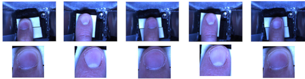

# Image Registration via Spatial Transformer Networks for Fingernail Imaging Technique
[](http://robotics.coe.utah.edu/)

[](https://travis-ci.com/github/n-fallahinia/stn_image_registration/jobs/402230113)

_Author: Navid Fallahinia, University of Utah Robotics Center_

_n.fallahinia@utah.edu_

## Requirements

We recommend using python3 and a virtual env. When you're done working on the project, deactivate the virtual environment with `deactivate`.

```
$ virtualenv -p python3 .env
$ source .env/bin/activate
$ pip install -r requirements.txt
```

Note that this repository uses Tensorflow 2.3.0 and `tf.keras` API. There are major changes between TF 1 and TF 2 and this program does NOT support TF 1. 

Introduction to TF 1 vs. TF 2:
- [programmer's guide](https://www.tensorflow.org/guide/migrate)

## Task

Given a misaligned image of a human finger and fingernail, returns the aligned image (the ground truth images are aligned via Active Appearance Models).



Take the time to read this [page](http://www.cs.utah.edu/~jmh/Fingernail/index.html) on Fingernail Imaging technique. 

You can alos read about the Spatial transformer networks here:

  - The original paper: [here](https://arxiv.org/abs/1506.02025)
  - Some implementation: [here](http://torch.ch/blog/2015/09/07/spatial_transformers.html)

## Build the dataset

Unfortunately, the Fingernail dataset is not publicly available at this time. However, you can email the [author](n.fallahinia@utah.edu) to receive the datatset. 

Fingernail dataset (~8.6 GB) contains raw and registered images (via AAM) of human fingernails (Index. Middle, Ring and Thumb finger) for 18 human subjects with different fingernail sizes and textures.
Here is the structure of the data:

```
dataset/
    subj_01/
        raw_images/
            img_01_0001.jpg
            ...
        aligned_images/
            image_0001.jpg
            ...
    subj_02/
        ...
```

The images are named following `image_{IMGIdx}.jpg`. 

Once the download is complete, move the dataset into the main directory.
Run the script `build_dataset.py` which will split the dataset into train/dev/test subsets and will resize them to (290, 290).

```bash
$ python build_dataset.py --data_dir {$DATA} --output_dir {$DATASET}
```
## Quick Training

1. **Build the dataset**: make sure you complete this step before training

```bash
$ python build_dataset.py --data_dir {$DATA} --output_dir {$DATASET}
```

2. **Setup the parameters**: There is a `params.json` file for you under the main directory. You can set the parameters for the experiment. It looks like

```json
{
    "batch_size": 32,
    "num_epochs": 5,

    "num_channels": 16,
    "num_parallel_calls": 4,
    "save_summary_steps": 1,
    ...
}
```

For every new training job, you will need to create a new directory under `experiments` with a similar `params.json` file.

3. **Train the model**. Simply run

```
python train.py --data_dir {$DATA} --log_dir {$LOG}
```

It will instantiate a model and train it on the training set following the parameters specified in `params.json`. It will also evaluate some metrics on the development set.

4. **Evaluation on the test set** Once you've selected the best model based on the performance on the development set, you can finally evaluate the performance of your model on the test set. You can run a simple test to check the image alignment performance:

```
python activation_test.py --data_dir {$DATA} --model_dir {$BEST_MODEL_PATH}
```


